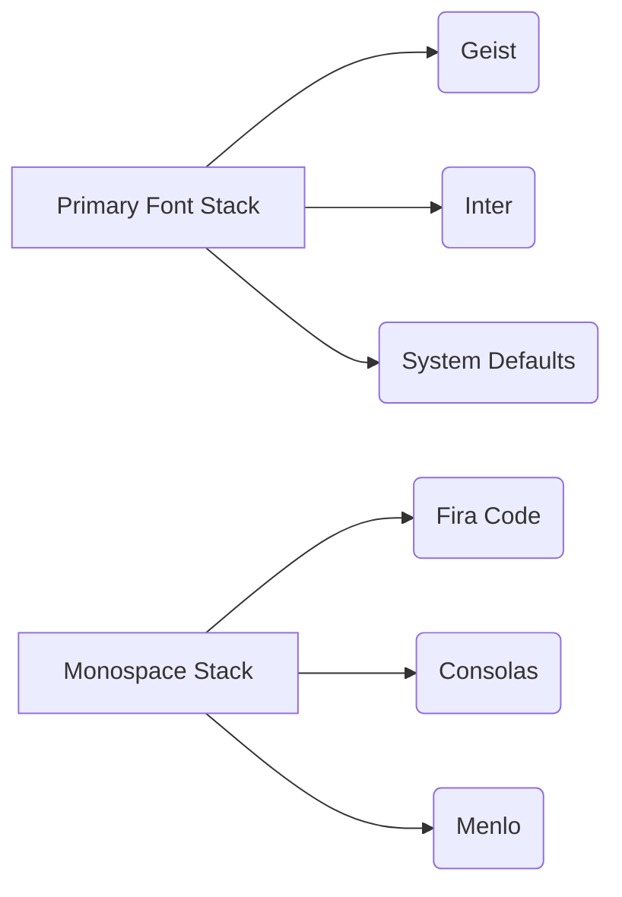
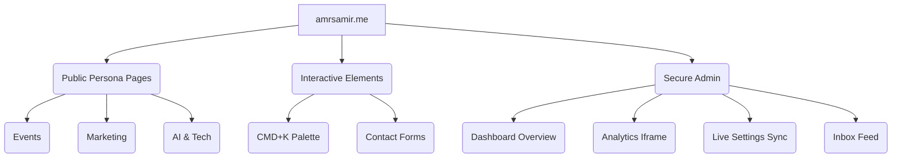

# ✦ Design System & UI Guidelines

Welcome to the official Design System for **amrsamir.me**. This document acts as the single source of truth for the platform's visual language, bridging the gap between the public-facing minimalist architecture and the secure, functional admin panel.


---

## 1. Core Philosophy

The overarching aesthetic is rooted in **minimalism, focus, and raw performance**. The public website acts as a developer-centric portfolio (inspired by CLI/terminal interfaces), while the Admin Panel introduces structured glassmorphism for enhanced usability—while still offering a "Classic Black" toggle for aesthetic parity.

> [!TIP]
> **Performance First**
> The design system relies heavily on Vanilla CSS and native browser capabilities to ensure lightning-fast load times. We avoid heavy CSS frameworks like Tailwind or Bootstrap to keep the bundle size minimal.

---

## 2. Design Tokens

These are the fundamental building blocks (variables) used across the platform.

### 🎨 Color Palette

| Token Name | Hex Value | Usage context |
| :--- | :--- | :--- |
| `--bg-primary` | `#000000` | Main backgrounds, core canvas. |
| `--bg-secondary`| `#0a0a0a` | Elevated surfaces, cards in dark mode. |
| `--border-color`| `#333333` | Subtle outlines, dividers, inputs. |
| `--text-main` | `#ededed` | Primary body text and headings. |
| `--text-muted` | `#888888` | Secondary text, placeholders, metadata. |

### 🔤 Typography

We utilize a modern, highly legible font stack optimized for digital interfaces.



- **Body Text**: `16px` (1rem) with a line-height of `1.6`.
- **Headings**: Semi-bold (`600`) scaling down for mobile responsiveness.
- **Micro-copy**: `14px` (`0.875rem`) for hints and small labels.

---

## 3. The Dual-Theme Architecture

The Admin Panel features a unique Dual-Theme architecture, allowing the owner to switch between a rich, interactive environment and a focused, stark environment.

````carousel
```css
/* THEME 1: Glassmorphism (Default) */
.glass-panel {
  background: rgba(30, 41, 59, 0.5);
  backdrop-filter: blur(12px);
  border: 1px solid rgba(255, 255, 255, 0.05);
  border-radius: 16px;
}
```
<!-- slide -->
```css
/* THEME 2: Classic Black (Strict Minimalist) */
body[data-theme="classic-black"] .glass-panel {
  backdrop-filter: none;
  background: var(--bg-secondary);
  border: 1px solid var(--border-color);
  border-radius: 6px;
}
```
````

### Theme Behaviors:
1. **Glassmorphism**: Relies on `backdrop-filter: blur()`, abstract floating CSS animations (the "blobs"), and slightly rounded corners (`16px`).
2. **Classic Black**: Disables all background animations, removes background blurs, enforces `#000` and `#0a0a0a` backgrounds, and sharpens border radii to `6px` for a strict, terminal-like feel.

---

## 4. Components

### Inputs & Forms
Forms follow a strict vertical layout with top-aligned labels.
- **Padding**: `14px 16px`
- **Focus State**: Uses a solid primary color border with a subtle box-shadow ring to indicate active focus.

### Buttons
Buttons are strictly constrained to necessary actions.
- **Primary**: Solid background using the accent color, high contrast text.
- **Secondary**: Transparent background with a subtle border, used for secondary actions like "Refresh" or "Toggle Theme".

---

## 5. UI/UX Flow (Mind Map)

Here is a visual map of how a user (both public and admin) navigates the design system.


