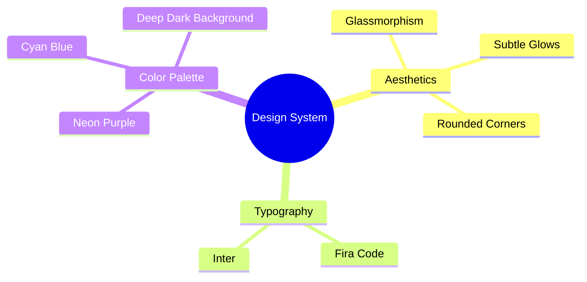

# Design System


Welcome to the **Nebula Design System**. This document outlines the core aesthetic principles, typography, and color tokens that power the visual identity of the entire platform.



## 1. Core Principles

The design philosophy is centered around a **Premium Dark Aesthetic** with vibrant accents, glassmorphism, and subtle micro-animations. It is designed to feel highly interactive, responsive, and visually stunning.

## 2. Color Palette

The color system relies on deep, rich backgrounds contrasted with highly saturated neon accents.

### Primary Accents
- **Cyberpunk Purple**: `#8b5cf6` (Primary action buttons, active states)
- **Forest Green**: `#10b981` (Success states, secondary accents)
- **Sunset Orange**: `#f97316` (Warning states, tertiary accents)

### Base Colors
- **Classic Black (Background)**: `#050505`
- **Surface Dark**: `#111111`
- **Surface Lighter**: `#1a1a1a`
- **Text Primary**: `#ffffff`
- **Text Secondary**: `#a1a1aa`
- **Text Muted**: `#71717a`

## 3. Typography

- **Primary Font**: `Inter`, sans-serif
- **Headings**: Bold, tight letter-spacing (-0.02em)
- **Body**: Regular weight, optimal line height (1.6) for readability

## 4. UI Components

### Glassmorphism Panels
Used for cards, the admin sidebar, and elevated containers.
```css
background: rgba(255, 255, 255, 0.03);
backdrop-filter: blur(10px);
border: 1px solid rgba(255, 255, 255, 0.05);
border-radius: 12px;
```

### Buttons
- **Primary Button**: Uses the `Cyberpunk Purple` accent with a subtle glow on hover.
- **Secondary Button**: Transparent background with a `rgba(255,255,255,0.1)` border, turning solid on hover.

### Inputs
- **Text Fields**: Dark background (`rgba(255,255,255,0.05)`), white text, rounded corners (`8px`), with a subtle border that highlights to purple on focus.

## 5. Animations

- **Hover Effects**: All interactive elements scale slightly (1.02) and shift up (-2px) with a smooth `0.2s ease` transition.
- **Page Load**: Elements fade in and slide up using the `Reveal` animation (`0.8s ease-out`).
- **Background**: The main background features a slow, continuous radial gradient pulse to add depth without being distracting.
