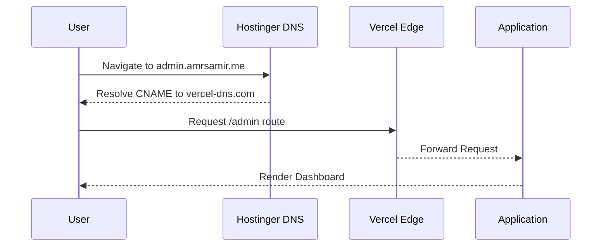

# Domain & URL Guide

This document lists all active URLs associated with your platform. 

## Main Connected Domains (Hostinger)
These are your primary, custom domains. They will become fully active as soon as the DNS propagation finishes (typically 5 to 60 minutes after you update the A records in Hostinger).

- **Main Website**: [https://amrsamir.me](https://amrsamir.me)
- **Admin Dashboard**: [https://admin.amrsamir.me](https://admin.amrsamir.me)
- **CV Tracker**: [https://cv.amrsamir.me](https://cv.amrsamir.me)

## Temporary Vercel URLs
While you wait for the DNS propagation on Hostinger to complete, you can use these Vercel-generated URLs immediately. They are live right now and bypass the DNS wait time.

- **Main Website**: [https://amrsamir-me-final.vercel.app](https://amrsamir-me-final.vercel.app)
- **Admin Dashboard**: [https://amrsamir-me-final.vercel.app/admin/](https://amrsamir-me-final.vercel.app/admin/)
- **CV Tracker**: [https://amrsamir-me-final.vercel.app/cv/](https://amrsamir-me-final.vercel.app/cv/)

---

### A Note on Form Responses
Your contact form on the main website has already been fully integrated with your custom backend. When a visitor submits a message on the main site, it does **not** use third-party services like Formspree anymore. 

Instead, it securely pushes the data directly into your Supabase database (`form_submissions` table), and you can read the messages in real-time by clicking the **"Inbox"** tab right here in your Admin Dashboard!
