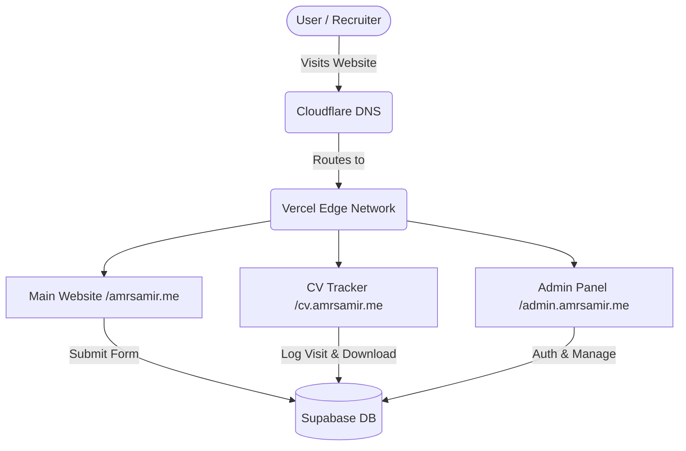
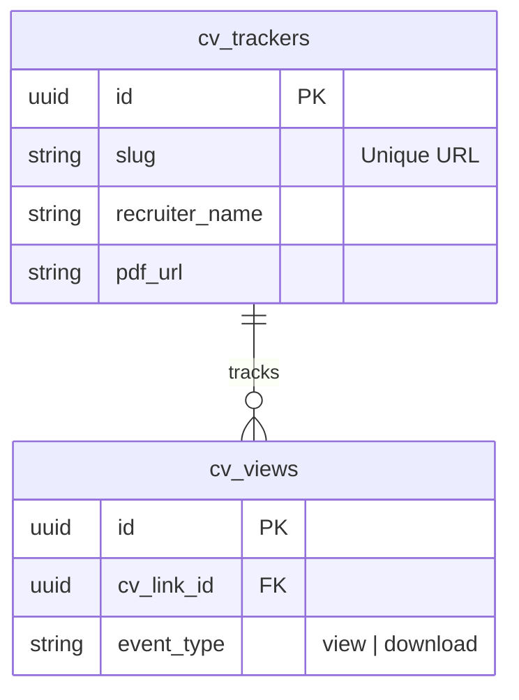

# Platform Architecture


This document provides a high-level overview of the `amrsamir.me` software architecture, database schemas, and networking layer.

## System Flow



This document serves as a comprehensive brief and map of the `amrsamir.me` project. It is intended for software engineers, stakeholders, and developers who need to understand the structural, architectural, and technological foundation of the platform.

---

## 1. System Architecture & Tech Stack

The platform is designed as a modern, serverless, and highly performant web application.

### Frontend
- **Framework**: **Vite** (Vanilla JavaScript + HTML/CSS). Chosen for lightning-fast builds and zero-overhead performance.
- **Styling**: Vanilla CSS utilizing modern variables, CSS grid/flexbox, and micro-animations (like glassmorphism and abstract floating elements).

### Backend & Database (BaaS)
- **Provider**: **Supabase** (PostgreSQL).
- **Authentication**: Supabase Auth (Email/Password) used to secure the Admin Dashboard.
- **Data Access**: Row Level Security (RLS) is strictly enforced. Public users can read settings and submit forms, but only authenticated users can edit settings or view the inbox.

### Analytics & Tracking
- **PostHog**: Integrated via `posthog-js` for comprehensive product analytics, session recordings, pageviews, and heatmaps.
- **Vercel Analytics**: Built-in Vercel analytics package (`@vercel/analytics`) for basic traffic and web vitals monitoring.

### Hosting & CI/CD
- **Provider**: **Vercel**. 
- **Deployment Flow**: Any push to the main GitHub branch triggers an automatic production build and deployment to Vercel.

---

## 2. Site Map & Routing

The application is structured as a Multi-Page Application (MPA) using Vite's Rollup configuration.

### Public Facing Pages

- **`/` (Home Hub)**  
  `index.html` — The main entry point. Features the dynamic background, the command palette (`CMD+K`), and a grid leading to the different personas. Also includes the dynamically fetched Substack newsletter embed.

- **`/events` (Events Persona)**  
  `events/index.html` — Portfolio tailored for events management and production. Contains a contact form that pushes data to Supabase.

- **`/marketing` (Marketing Persona)**  
  `marketing/index.html` — Portfolio tailored for brand strategy and digital marketing. Contains a contact form that pushes data to Supabase.

- **`/ai` (AI & Tech Persona)**  
  `ai/index.html` — Portfolio tailored for tech innovations and AI agents. Contains a contact form that pushes data to Supabase.

- **`404.html`**  
  Custom 'Not Found' page for handling broken routes.

### Secure Internal Pages

- **`/admin` (Admin Control Panel)**  
  `admin/index.html` — Secure dashboard exclusively for the owner. 
  - **Login Screen**: Prevents unauthorized access.
  - **Settings View**: Allows the owner to dynamically update global links (WhatsApp, Email, LinkedIn, Substack). Updates here are instantly reflected across all public pages.
  - **CV Tracker**: Dynamic CV link generator that allows the owner to select an uploaded PDF from the `cv_pdfs` Supabase bucket, define a custom slug (e.g., `apple`), and instantly generate a tracking link.
  - **Documentation**: Dynamic markdown renderer for viewing and extracting Architecture, Design System, and Domain Guides as PDFs.

- **`/cv` (Dynamic CV Redirects)**  
  `cv/index.html` — Endpoint for handling customized CV links (e.g., `amrsamir.me/cv/apple`). Fetches the recruiter record and automatically redirects to the stored PDF in the Supabase bucket.

### External Applications (Isolated Repositories)
The following platforms are hosted entirely separately from the main `amrsamir.me` repository to decouple complex logic and prevent clutter:
- **Shop**: E-commerce interface (TBD)
- **Tools**: Specialized software tools interface (TBD)

---

## 3. Database Schema

The PostgreSQL database (managed via Supabase) contains two primary tables:

### `public.settings`
Stores the global dynamic links used across the platform.
- `id` (bigint, PK)
- `whatsapp` (text)
- `email` (text)
- `linkedin` (text)
- `substack` (text)
- `updated_at` (timestamp)

*RLS Rules*: Public can read (SELECT). Only Auth can UPDATE.

### `public.cv_views`
Logs every time someone views or downloads a CV.
- `id` (uuid, PK)
- `cv_link_id` (uuid, FK to cv_trackers)
- `event_type` (text) - 'view' or 'download'
- `created_at` (timestamp)



*RLS Rules*: Public can read (SELECT). Only Auth can UPDATE.

### `public.form_submissions` (Deprecated/Removed)
Previously stored messages sent by users. Forms now submit via **Formspree** which bypasses the database completely.

### `public.cv_trackers`
Stores generated, custom CV links.
- `id` (uuid, PK)
- `slug` (text, unique) - The custom URL path (e.g., 'apple')
- `recruiter_name` (text)
- `pdf_url` (text) - URL pointing to the PDF inside the `cv_pdfs` bucket
- `created_at` (timestamp)

*RLS Rules*: Public can read (SELECT). Only Auth can INSERT/UPDATE/DELETE.

### Storage Bucket: `cv_pdfs`
A public Supabase Storage bucket used exclusively for storing different versions of PDF CVs. The Admin Dashboard populates its upload dropdown by fetching the file list from this bucket.

---

## 4. Environment Variables

To run this project, the following variables must be present in the local `.env` file and the Vercel Production Environment Settings:

```env
# Required to connect the frontend to the database
VITE_SUPABASE_URL=https://<your-project-id>.supabase.co
VITE_SUPABASE_ANON_KEY=eyJhbGci...

# Note: PostHog API key is public and hardcoded in main.js
```
